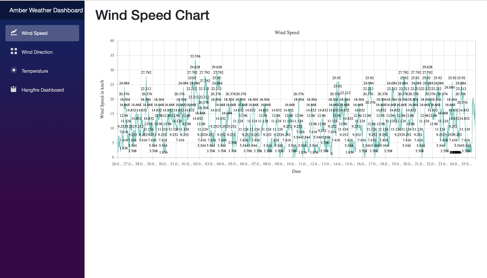
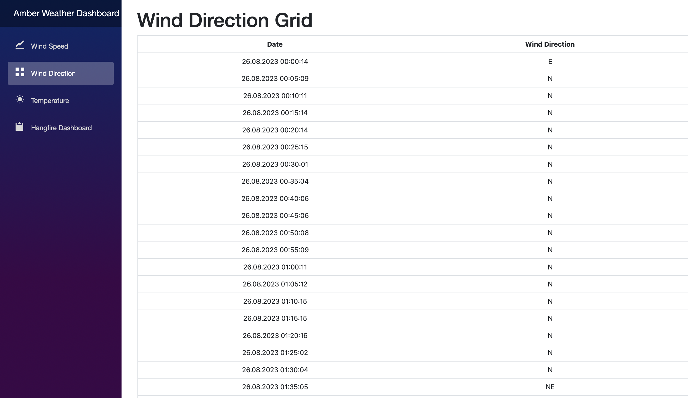
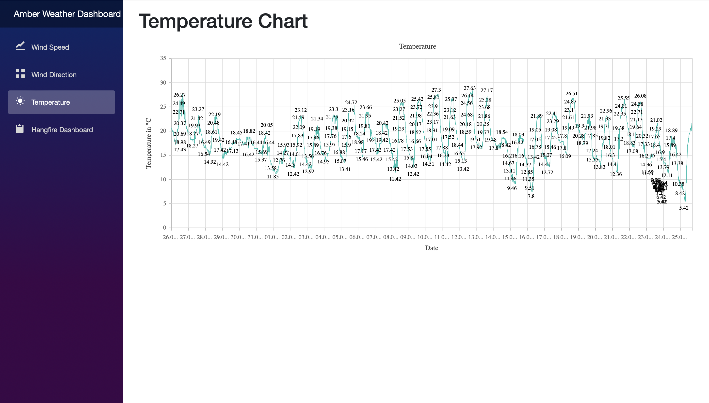
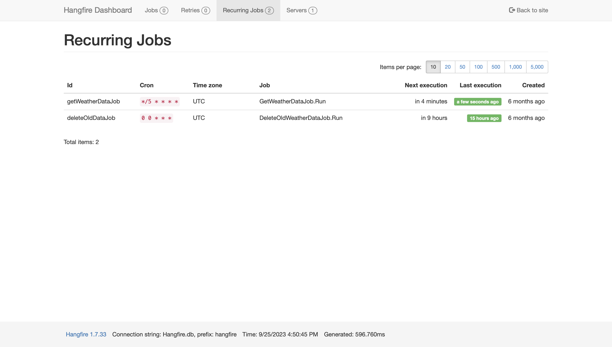

# Amber Weather Dashboard

The Amber Weather Dashboard is an application built for amber collectors in Gdynia, designed to help them track and monitor weather conditions that can impact their collection activities. This project allows users to access a user-friendly dashboard presenting essential weather data, including wind speed, wind direction, and temperature. The data is regularly updated on an hourly basis and is stored for a month, ensuring users have access to historical weather information.

## App Screenshots

Here are some screenshots of Amber Weather Dashboard in action:

## Features

- **User-Friendly Dashboard:** The application provides an intuitive dashboard interface with separate tabs for wind speed, wind direction, and temperature data.

- **Hourly Data Updates:** The weather data is updated every hour, ensuring that users have access to the most recent information for making informed decisions.

- **Data History:** The application stores weather data for a month, allowing users to review historical weather patterns and trends.

## Technologies Used

- **.NET 7:** The project is developed using the latest version of the .NET framework, which provides a robust and efficient environment for building web applications.

- **Hangfire:** Hangfire is used to manage background jobs, ensuring timely and accurate updates to the weather data.

- **Blazor:** The Blazor framework is utilized to create interactive and dynamic user interfaces, enabling seamless interaction with the weather dashboard.

- **SQLite:** SQLite is chosen as the database engine for its lightweight nature and simplicity, making it a suitable choice for storing weather data.

- **Entity Framework:** Entity Framework is employed to manage the application's data model, simplifying database interactions and data management.

## Getting Started

Follow these steps to get the Amber Weather Dashboard up and running on your local machine:

1. **Clone the Repository:** Begin by cloning this repository to your local machine using the following command:
git clone https://github.com/a.budzikowsk/amber-weather-dashboard.git

2. **Navigate to the Project Folder:** Move into the project directory using the following command:
cd amber-weather-dashboard

3. **Build and Run:** Use the .NET CLI to build and run the application:
dotnet run

4. **Access the Dashboard:** Open your web browser and navigate to `http://localhost:5000` to access the Amber Weather Dashboard.

